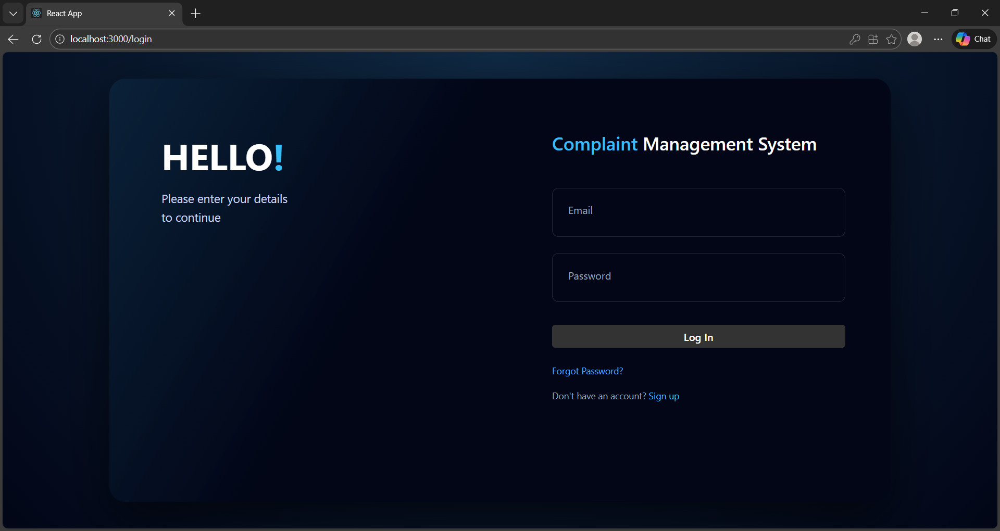
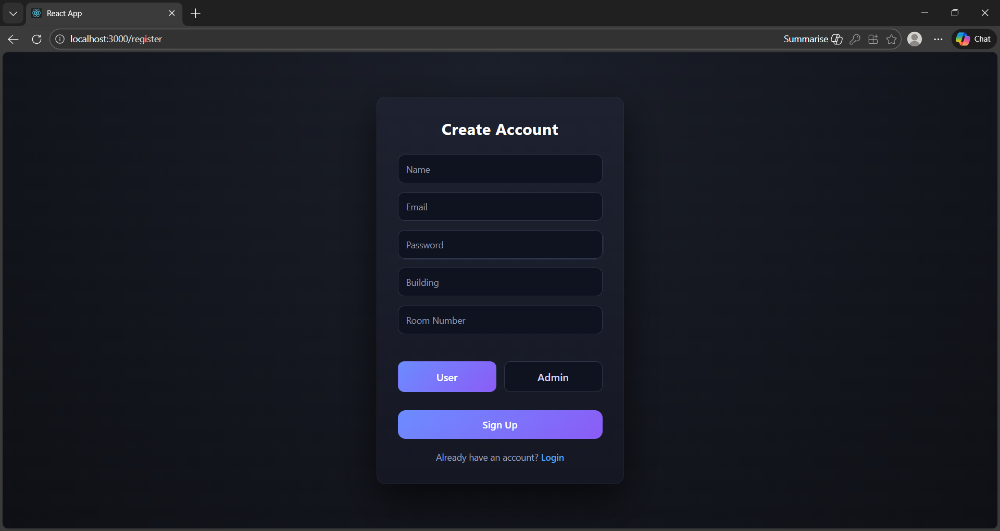
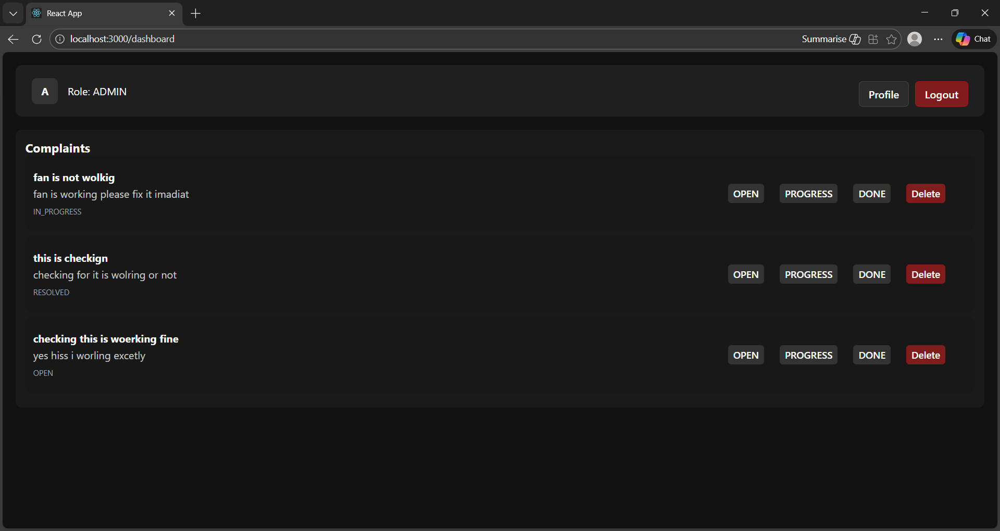
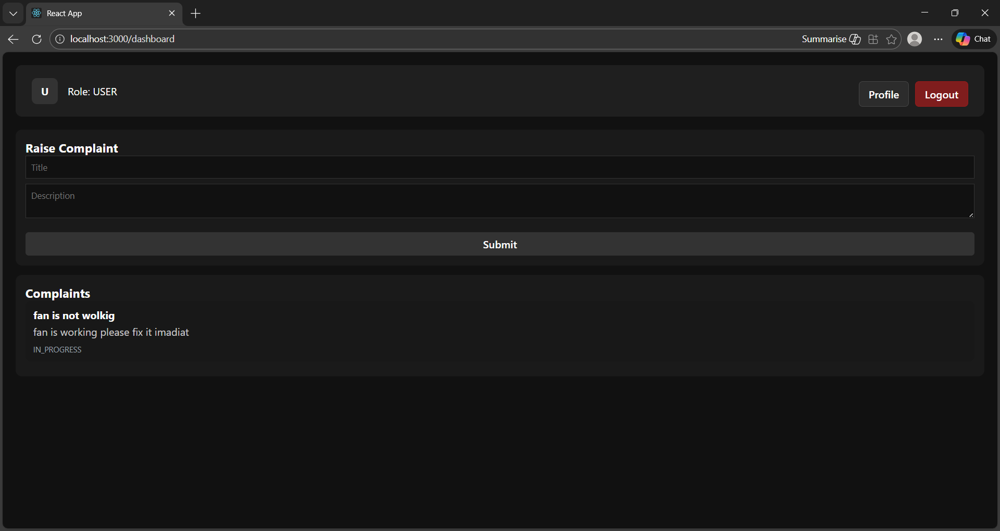

# 🏢 Smart Facility: Complaint Management System

A professional, full-stack **Complaint Management System** designed for streamlined facility management. Built with a **React** frontend and a **Spring Boot** backend, featuring **JWT Authentication** and **Role-Based Access Control (RBAC)**.

---

## 🚀 Features

- **Secure Authentication**: Implementation of JWT (JSON Web Tokens) for stateless security.
- **Role-Based Access**: Specialized dashboards for **ADMIN** and **USER** roles.
- **Complaint Lifecycle**: Users can raise complaints; Admins can track, update, and resolve them.
- **Real-time Status Tracking**: Management of complaint states (OPEN, IN_PROGRESS, RESOLVED).
- **Modern UI**: Fully responsive, dark-themed interface for a premium user experience.
- **Profile Management**: View account details including building and room assignments.

---

## 📸 Screenshots

### 🔑 Authentication

#### Login Page
The gateway to the system, featuring a modern split-panel design.


#### User Registration
Simple and effective onboarding for new facility members.


---

### 📊 Dashboards

#### Admin Dashboard
Admins have full visibility of all facility issues with the ability to update status or remove records.


#### User Dashboard
Users can raise new complaints via a clean form and track their specific issues.


---

## 🛠 Tech Stack

**Frontend**
- **React 19**: Modern component-based architecture.
- **React Router 7**: Navigation and virtual routing.
- **Lucide React**: Premium iconography.
- **CSS3**: Custom dark-themed styling.

**Backend**
- **Spring Boot 3.2**: Robust Java framework.
- **Spring Security**: Advanced security and JWT integration.
- **Hibernate / JPA**: Simplified database interactions.
- **PostgreSQL**: Reliable relational database storage.

---

## 🔐 Authentication & Roles

| Feature | USER | ADMIN |
| :--- | :---: | :---: |
| Raise Complaints | ✅ | ❌ |
| View Own Complaints | ✅ | ✅ |
| View All Complaints | ❌ | ✅ |
| Update Status | ❌ | ✅ |
| Delete Complaints | ❌ | ✅ |

---

## ⚙️ Local Development Setup

### 1. Prerequisites
- **Java 17+**
- **Node.js 18+**
- **PostgreSQL** (ensure a database named `complaint_db` is created)

### 2. Backend Setup
1. Open `src/main/resources/application.properties`.
2. Configure your local database connection:
   ```properties
   spring.datasource.url=jdbc:postgresql://localhost:5432/complaint_db
   spring.datasource.username=postgres
   spring.datasource.password=your_password
   
   spring.jpa.hibernate.ddl-auto=update
   spring.jpa.show-sql=true
### 3. Frontend Setup

Navigate to the `complaint-frontend` folder.

Install dependencies:


npm install
## ✅ Project Status

- JWT Security Implementation  
- Database Schema Design (PostgreSQL)  
- Role-Based UI Rendering  
- Frontend-Backend Integration (REST API)  
- Responsive Dark UI  

---

### 👤 Author

Developed by **Dadu**  
Full-Stack Developer specializing in **Java Spring Boot** and **React**
