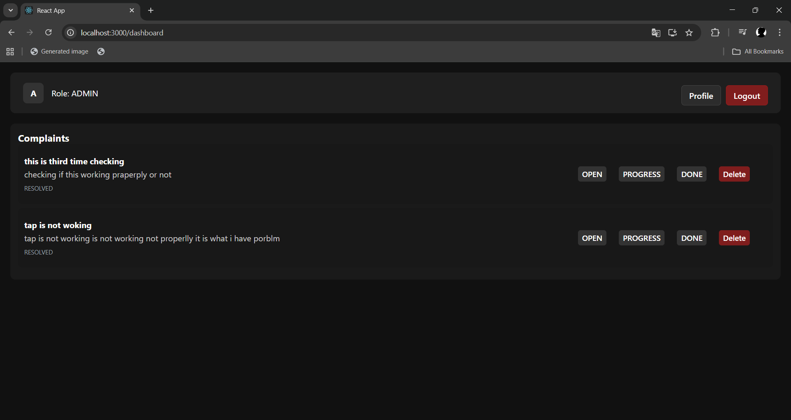

# Complaint Management System

A modern **Complaint Management System** built using **React** for the frontend and **Spring Boot** for the backend with **JWT authentication** and **role-based access control**.

---

## Features

- Secure login using JWT
- Role-based access (ADMIN / USER)
- Users can raise and track complaints
- Admins can manage, update, and delete complaints
- Modern dark-themed UI
- Profile page with logout functionality
- Forgot password & user registration

---

## Screenshots

### Login Page

### User Dashboard

### Admin Dashboard

---

## Tech Stack

**Frontend**
- React
- React Router
- CSS (Dark UI)

**Backend**
- Spring Boot
- Spring Security
- JWT Authentication
- Hibernate / JPA
- MySQL

---

## Authentication & Roles

- **USER**
    - Raise complaints
    - View complaint status

- **ADMIN**
    - View all complaints
    - Change complaint status (OPEN / PROGRESS / DONE)
    - Delete complaints

---

## How It Works

1. User logs in and receives a JWT token
2. Token is stored in browser storage
3. All protected APIs use the token
4. Dashboard UI changes based on user role

---

## Status

✅ Login & Registration  
✅ JWT Security  
✅ Role-based Dashboards  
✅ Complaint CRUD  
✅ Modern UI

---

## Author

Developed as a full-stack project with React and Spring Boot.
